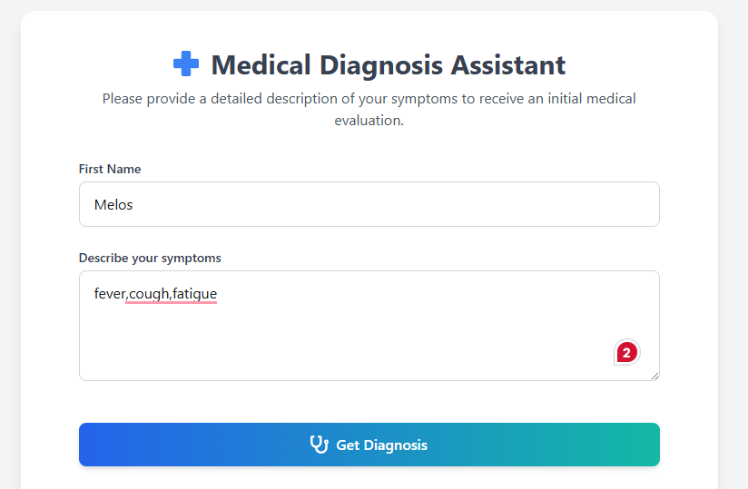
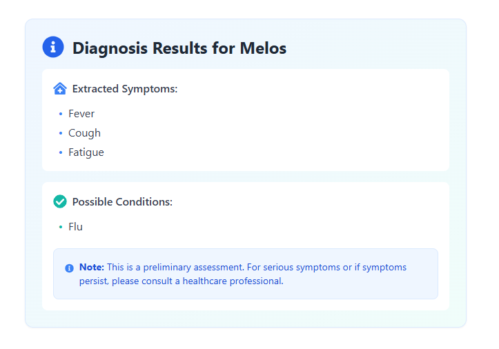
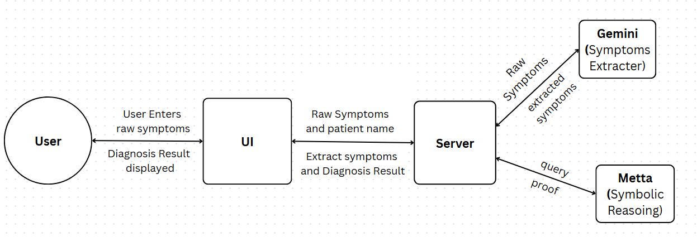

# 🧠 Neuro-Symbolic Medical Diagnosis Assistant

A hybrid AI system combining **neural networks (Gemini)** and **symbolic reasoning (MeTTa)** to deliver accurate, explainable medical diagnoses from raw symptom input.

## Overview

This project integrates the strengths  of **neural networks** and **symbolic reasoning** to create a reliable, explainable medical diagnosis assistant. Neural networks analyze complex, noisy symptom data, while symbolic logic applies medical knowledge rules for transparent and justifiable diagnostic decisions.

The system features a patient-friendly **web interface** that accepts symptom inputs and delivers detailed, interpretable diagnostic insights.

## Features

- **Hybrid AI Architecture:** Combines Gemini’s neural models with MeTTa’s symbolic reasoning for enhanced accuracy and explainability.

- **Explainable Diagnostics:** Symbolic rules provide clear reasoning paths for each diagnosis.

- **Flexible Symptom Input:** Accepts structured or free-text symptom descriptions.

- **Modern Web  UI:** Intuitive UI accessible across devices.

## ScreenShots

### Diagnosis Form



### Diagnosis Result



## Architecture Overview



1. User types raw symptoms in the React client.

2. Gemini LLM extracts structured symptoms from raw input.

3. Extracted symptoms are added to the knowledge base.

4. A query (`does patient have disease?`) is issued.

5. MeTTa’s backward chaining symbolic engine generates proofs and proposes possible diseases based on encoded medical rules.

6. Diagnostic results are sent back to the client.

## Technical Approach

- **Neural Layer (Gemini):** Performs natural language understanding to extract patient symptoms from unstructured text.

- **Symbolic Layer (MeTTa):** Uses a **curried backward chaining** reasoning strategy to query medical rules and produce explainable diagnoses.

- The hybrid system synergizes the robustness of deep learning with transparent logical inference.

## Getting Started

### Prerequisites

- `Python 3.10+`
- `Node.js` (for frontend)
- `Gemini` Google API Key
- `MeTTa (Hyperon)` symbolic reasoning environment

## Project Structure

```bash
/backend - FastAPI server and symbolic reasoning code
/frontend - React client application
```

### Installation

#### 1. Clone the repository:

```bash
git clone https://github.com/melos-simeneh/neuro-symbolic-medical-diagnosis-assistant.git
cd neuro-symbolic-medical-diagnosis-assistant
```

#### 2. Set up Python environment and install dependencies:

```bash
python -m venv venv
source venv/bin/activate
pip install -r requirements.txt
```

#### 3. Create `.env` file in `/backend` directory:

```env
GEMINI_API_KEY=your_api_key_here
```

#### 4. Run the backend server:

```bash
cd backend
uvicorn app.main:app --reload --port 3000
```

Access the Swagger API docs at: [http://localhost:3000](http://localhost:3000)

#### 5. Start the frontend client:

```bash
cd frontend
npm install
npm start
```

Frontend will be available at: [http://localhost:5173](http://localhost:5173)

## Usage

1. Open the React client in your browser [http://localhost:5173](http://localhost:5173).

2. Enter the patient's first name and symptoms in the input form.

3. Submit and receive diagnosis results inferred by the neuro-symbolic system.

## Future Improvements

- **Expand Rule Base and Reasoning Logic:** Add more comprehensive symbolic rules and inference strategies to improve diagnostic accuracy and explainability.

- **Confidence Scores:** Introduce confidence levels for each diagnosis to help users assess the certainty of results and guide informed medical decisions.

## Contact

Made with 💚 by **MELOS**

For issues, suggestions, or contributions, feel free to open an issue.
